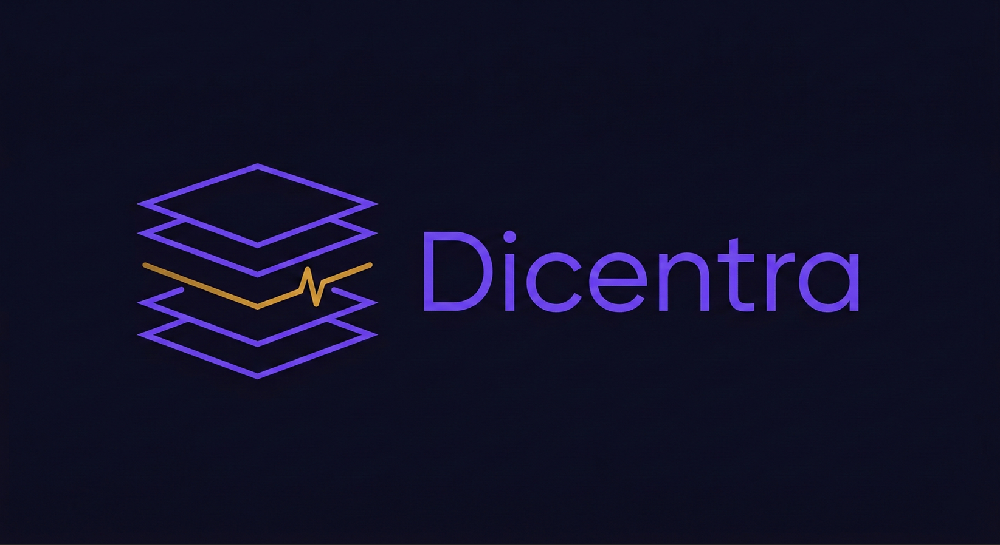
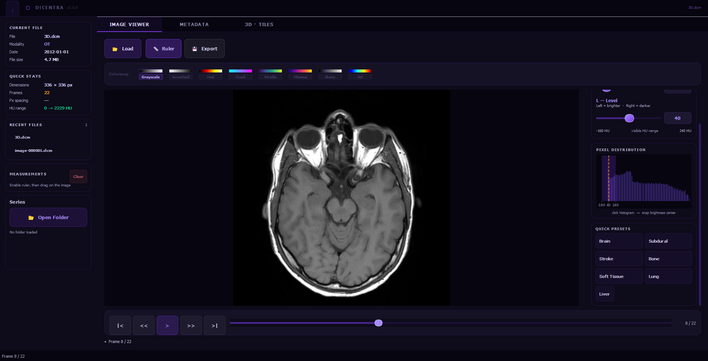

<div align="center">



# Dicentra

### Clinical DICOM viewer: window/level, colormaps, series browser, metadata, zero configuration

<br/>

[](https://python.org)
[](https://riverbankcomputing.com/software/pyqt/)
[](LICENSE)
[](CONTRIBUTING.md)
[](https://github.com/Kareem-Taha-05/dicentra/actions)
[](#running-tests)

<br/>


<br/><br/>

[**Documentation**](https://Kareem-Taha-05.github.io/dicentra) &nbsp;·&nbsp;
[**Report a Bug**](https://github.com/Kareem-Taha-05/dicentra/issues/new?template=bug_report.md) &nbsp;·&nbsp;
[**Request a Feature**](https://github.com/Kareem-Taha-05/dicentra/issues/new?template=feature_request.md)

</div>

---

## What is Dicentra?

Most DICOM viewers are either heavyweight clinical suites that take an hour to install, or bare-bones research scripts that display a grey square. Dicentra is neither.

It opens a CT volume in seconds, auto-computes the correct window/level from the actual pixel data, lets you scrub through every slice with full W/L control, and keeps every panel — series browser, histogram, metadata — perfectly in sync. Built entirely on open-source Python: **PyQt5 · pydicom · NumPy · Matplotlib**.

> **Not for clinical use.** Research and educational purposes only.

---

## Features

<table>
<tr>
<td align="center" width="33%">
<b>🔆 Window / Level</b><br/><br/>
Auto-computes W/L from the 1st–99th percentile on load so the full image is always visible immediately. Live HU sliders, exact spinboxes, and 7 clinical presets: Brain, Bone, Lung, Soft Tissue, Liver, Subdural, Stroke.
</td>
<td align="center" width="33%">
<b>📊 Live HU Histogram</b><br/><br/>
Per-frame pixel distribution with a W/L overlay band that updates as you drag. Click any bar to snap the Level (brightness center) to that HU value instantly.
</td>
<td align="center" width="33%">
<b>🎨 8 Colourmap LUTs</b><br/><br/>
Grayscale, Inverted, Hot, Cool, Viridis, Plasma, Bone, Jet — as clickable swatch chips. The selected LUT is re-applied on every W/L change, live.
</td>
</tr>
<tr>
<td align="center" width="33%">
<b>📂 DICOM Series Browser</b><br/><br/>
Open a folder and Dicentra groups all files by <code>SeriesInstanceUID</code>, generates thumbnails in a background thread, and shows modality badges, descriptions, and slice counts. Click a card to load the full volume.
</td>
<td align="center" width="33%">
<b>📏 Measurement Ruler</b><br/><br/>
Toggle ruler mode and click-drag anywhere on the image. Distance is shown in millimetres using the <code>PixelSpacing</code> DICOM tag. Up to 5 colour-coded measurements simultaneously.
</td>
<td align="center" width="33%">
<b>🗂 Metadata Browser</b><br/><br/>
Every DICOM tag in a searchable, sortable table. Filter chips for Patient, Study, Modality, Equipment, Image, and Pixel Data categories. Built-in anonymisation with a custom prefix.
</td>
</tr>
</table>

---

## Screenshots

<table>
<tr>
<td></td>
<td></td>
</tr>
<tr>
<td align="center"><em>Image viewer: W/L sliders, live histogram, colormap chips</em></td>
<td align="center"><em>Full metadata tag table</em></td>
</tr>
</table>

---

## Quick Install

```bash
git clone https://github.com/Kareem-Taha-05/dicentra.git
cd dicentra
python -m venv .venv
source .venv/bin/activate      # Windows: .venv\Scripts\activate
pip install -r requirements.txt
python main.py
```

<details>
<summary><b>Windows</b></summary>

No extra steps required. PyQt5 ships its own Qt binaries on Windows.

</details>

<details>
<summary><b>Linux</b></summary>

You may need Qt system libraries if they are not already installed:

```bash
sudo apt-get install libxcb-xinerama0 libxkbcommon-x11-0
```

</details>

<details>
<summary><b>macOS</b></summary>

No extra steps required on modern macOS (Intel or Apple Silicon).

</details>

---

## Usage

### Load a single DICOM file

```bash
python main.py
```

Click **📂 Load** and select any `.dcm` file. The image displays immediately at full dynamic range — W/L is auto-computed from the pixel data.

### Load a DICOM series (multi-slice CT / MRI)

Click **📁 Open Folder** in the left sidebar. Dicentra scans the folder in the background, groups files by `SeriesInstanceUID`, and shows a card for each series. Click a card to load all slices as a scrollable volume with full playback controls.

### Programmatic API

```python
from app.data.dicom_model import DicomModel
from app.logic.image_processor import apply_window_level
import numpy as np

# Load a file
model = DicomModel()
model.load("brain_ct.dcm")

# Apply Brain window/level
ds        = model.dataset
slope     = float(getattr(ds, "RescaleSlope",     1.0))
intercept = float(getattr(ds, "RescaleIntercept", 0.0))
hu  = model.frames[0].astype(np.float32) * slope + intercept
img = apply_window_level(hu, window_width=80, window_center=40)  # → uint8
```

---

## Architecture

```
┌─────────────────────────────────────┐
│  View  (app/gui/)                   │
│  Pure reactive Qt widgets           │
└──────────────┬──────────────────────┘
               │ Qt signals
┌──────────────▼──────────────────────┐
│  Controller  (app/logic/controller) │
│  W/L: raw_hu_frames cache           │
│  → apply_window_level() pure fn     │
└──────────────┬──────────────────────┘
               │ method calls
┌──────────────▼──────────────────────┐
│  Model  (app/data/dicom_model.py)   │
│  Zero Qt imports — fully testable   │
└─────────────────────────────────────┘
```

| Module | Responsibility |
|--------|---------------|
| `app/data/dicom_model.py` | File I/O, frame decoding, series loading |
| `app/logic/controller.py` | W/L rendering (MedVol pattern), frame navigation, signals |
| `app/logic/image_processor.py` | Pure functions: `apply_window_level`, `compute_histogram` |
| `app/gui/main_window.py` | Shell layout, header bar, tab routing |
| `app/gui/image_tab.py` | Canvas, playback controls, colormap chips |
| `app/gui/series_browser.py` | Left sidebar — series cards, file info, measurements |
| `app/gui/metadata_tab.py` | DICOM tag browser, category filters, anonymisation |

---

## Roadmap

- [x] Single-frame and multi-frame DICOM loading
- [x] DICOM series loading (folder → auto-group by SeriesInstanceUID)
- [x] Window/Level with clinical presets and live histogram
- [x] 8 colourmap LUTs
- [x] Measurement ruler (mm)
- [x] Export: PNG, JPEG, animated GIF, CSV, JSON
- [x] Full metadata browser with category filters
- [x] Deep Space Medical dark theme
- [ ] NIfTI / NIfTI-2 support
- [ ] DICOM RT structures overlay
- [ ] Multi-planar reconstruction (MPR)
- [ ] DICOM SR (structured report) viewer
- [ ] Window/Level touch gestures

---

## Compatible Public Datasets

| Dataset | Format | Link |
|---------|--------|------|
| TCIA Collections | DICOM | [cancerimagingarchive.net](https://www.cancerimagingarchive.net) |
| RSNA Challenges | DICOM | [rsna.org/education/ai-resources](https://www.rsna.org/education/ai-resources-and-training/ai-image-challenge) |
| OpenNeuro | NIfTI | [openneuro.org](https://openneuro.org) |
| Visible Human Project | DICOM | [nlm.nih.gov](https://www.nlm.nih.gov/research/visible/visible_human.html) |

---

## Running Tests

```bash
pytest tests/ -v
```

43 tests — all pure Python, no display required.

---

## Contributing

```bash
git clone https://github.com/Kareem-Taha-05/dicentra.git
cd dicentra
pip install -r requirements-dev.txt
pre-commit install
pytest tests/ -v
```

See [CONTRIBUTING.md](CONTRIBUTING.md) for code standards and PR process.

---

## License

MIT — see [LICENSE](LICENSE).

---

<div align="center">
Built with PyQt5 · pydicom · NumPy · Matplotlib · Pillow<br/>
If Dicentra helped your work, a ⭐ goes a long way.
</div>
